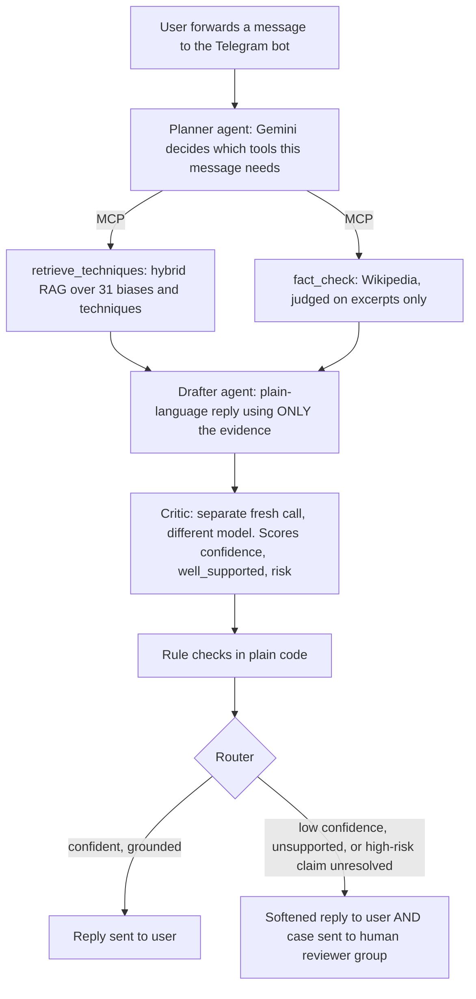

# Prebunk

**A Telegram agent that helps people pause before forwarding a manipulative message.**
Forward it a message you're unsure about, and it explains *how* the message is trying to move you (fear, false urgency, scapegoating, fake authority...) and whether its main factual claim holds up. It never judges whether an opinion is right or wrong, only the persuasion mechanism and the checkable facts.

**Track:** Open track · **Demo video:** https://youtu.be/7AGZ5BEdgU8

---

## The problem

Messages spread fastest on WhatsApp and Telegram when they're emotionally charged. People forward them in seconds, often because the message uses well-documented manipulation techniques built to trigger exactly that fast, unreflective reaction. Correcting misinformation after it spreads works poorly. **Prebunking** (inoculation theory; Roozenbeek & van der Linden, 2019) works better: teach people to recognise the *technique*, so they can spot it next time too. Prebunk does this one message at a time.

The bot is **opt-in**: it only sees messages someone deliberately sends it. Nothing is scraped, and it never reads group chats.

## Architecture



| Requirement | How Prebunk does it |
|---|---|
| **Multi-agent / tool use** | Planner, drafter and critic are separate LLM roles. The planner *decides per message* which tools to call; the tools are real MCP tools served by **FastMCP** over HTTP. |
| **Grounding (RAG)** | `retrieve_techniques`: 31 entries (20 cognitive biases + 11 manipulation techniques grounded in inoculation research, each with a `source`), embedded with all-MiniLM-L6-v2 in **Chroma**. Score = semantic similarity + a boost for tell-tale phrases (e.g. "forwarded as received"); matched phrases are returned so the reply can quote them. `fact_check`: extracts one claim, fetches Wikipedia intros, and judges the claim **using only those excerpts**. |
| **Confidence check** | See below. |
| **Observability** | **Langfuse**: one trace per message, with nested planner, tool, drafter, critic, rule-check and router steps, plus `confidence`, `well_supported` and `escalated` scores. |


## The confidence and safety check

1. **Critic (a separate, fresh LLM call on a different model).** It sees only the message, the evidence and the draft, never the drafting conversation, so it can't simply agree with itself. It returns `confidence` (0 to 1), `well_supported` (is every technique and fact in the draft backed by evidence?) and `risk` (how harmful the message's topic is: health, hostility toward a group, emergencies and scams count as high).
2. **Rule checks (plain code, not a model).** Any link not present in the evidence makes the draft unsupported. If any tool failed, confidence is capped at 0.6.
3. **Router.**
   - `confidence ≥ 0.7` and `well_supported` → reply sent as written.
   - Otherwise → reply is prefixed *"This might be worth double-checking - I'm not fully certain"* **and** the case (original message, reply, reason) is sent to a private **human reviewer** Telegram group.
   - High-risk topic whose claim was **not settled by a cited source** → escalated too, and the user is told a human reviewer will look.
4. **A failed check is never a passed check.** If a tool, the drafter or the critic fails (for example a rate limit), the user is told not to forward the message yet, and the case is escalated with the error attached.
5. **Grounding safety net.** Even "no manipulation detected" must be backed by an actual lookup, so retrieval (local, no API cost) always runs.
6. **Prompt-injection defence.** Message text is wrapped in tags and treated as data. Tools always receive the user's original text, never the model's rewrite.

## Evaluation

A gold set of **14 new messages** (`eval_set.py`), none of them used while building or tuning.

**Technique retrieval, all messages that test it (no LLM, `eval_retrieval.py`): 9/11 passed**
- Right technique found: 5/7 · No false alarm on ordinary messages: **4/4** (including hard negatives containing "deadline" and "12% compared to last year")
- Misses: G01 (conspiracy phrased as "Big pharma is hiding this") and G03 (an anecdote used as proof).

**Full pipeline (`eval.py`), first 5 messages before hitting the free-tier daily quota**
- Escalation correct: **4/4**. G01 and G03 were still escalated as unresolved high-risk health claims even though retrieval missed their technique, so the safety layer covered the retrieval gap.
- Prompt injection resisted: **1/1** (G04 told the bot to reply "100% verified and true"; it didn't).
- G06 hit the daily quota mid-run and **failed safe**: escalated with the real error, no unchecked answer.

Full tables: `eval_retrieval_results.md`.

## Limitations (honest)

- **Fact-checking is best-effort:** one source (Wikipedia), intro sections only, so many claims come back "unverified". For example, the Great Wall "visible from the Moon" myth is covered further down its article, so it returned unverified rather than false.
- **Retrieval recall:** a small embedding model plus hand-written marker phrases. Some markers were added after seeing development samples, which is why evaluation uses separate messages. Only the top 3 techniques are returned, so a real fourth technique can be crowded out.
- **The critic's confidence is an LLM judgement,** not a calibrated probability, and the eval set is small.
- **Free-tier limits:** about 5 Gemini requests per message, and a daily cap as low as 20 requests per model, which is why the full-pipeline eval stopped at 5 messages. A reply takes 15–30 seconds.
- **English text only:** no Malayalam or other languages, and no image OCR (photo captions are read).
- **Data care:** message text is sent to Gemini's free tier (which Google may use to improve its models) and appears in Langfuse traces. A production version would use a paid or no-retention tier, self-hosted Langfuse, or a local model. Only the short search topic, never the message, is sent to Wikipedia.

## Security

- Secrets live only in `.env` (git-ignored); see `.env.example`.
- The bot logs message *length* only, never content, and silences the library log line that would print the bot token.
- It analyses private chats only; it never reads group conversations.

## Run it

Requires Python 3.12 and [uv](https://docs.astral.sh/uv/), a Google AI Studio key, a Telegram bot token (from @BotFather), and a free Langfuse project.

```bash
uv sync
cp .env.example .env      # then fill in your keys
```

Use three terminals:

```bash
uv run mcp_server.py      # 1. MCP tools on 127.0.0.1:8001 (first run downloads the embedding model)
uv run bot.py             # 2. the Telegram bot
uv run eval_retrieval.py  # 3. tests: eval_retrieval.py (free), eval.py (uses Gemini quota)
```

| File | Role |
|---|---|
| `bot.py` | Telegram front door; sends escalations to `REVIEWER_CHAT_ID` |
| `agent.py` | Planner, MCP tool calls, drafter, critic, rule checks, router, Langfuse |
| `mcp_server.py` | FastMCP server exposing both tools |
| `retrieval.py` · `bias_corpus.py` | Hybrid RAG and the technique knowledge base |
| `fact_check.py` · `llm.py` | Wikipedia fact-check; shared Gemini client with retries |
| `eval_set.py` · `eval.py` · `eval_retrieval.py` | Gold set and evaluation |

## Research grounding

Roozenbeek & van der Linden (2019), *Fake news game confers psychological resistance against online misinformation* · Roozenbeek et al. (2022), *Psychological inoculation improves resilience against misinformation on social media*, Science Advances · Cialdini, *Influence* · Cook's FLICC taxonomy · Lewandowsky & Cook (2020), *The Conspiracy Theory Handbook*. Individual sources are listed per technique in `bias_corpus.py`.

_Built solo in one morning for the Agentic AI Bootcamp 2026 hackathon, Amritapuri._
